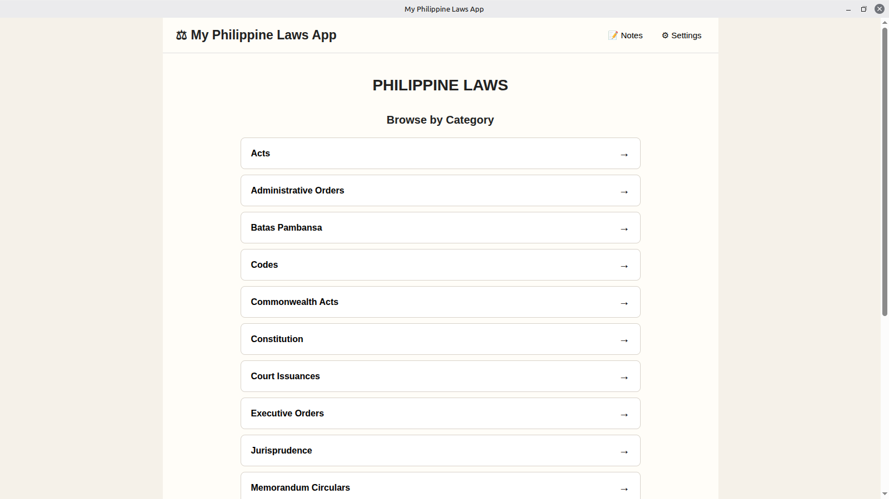
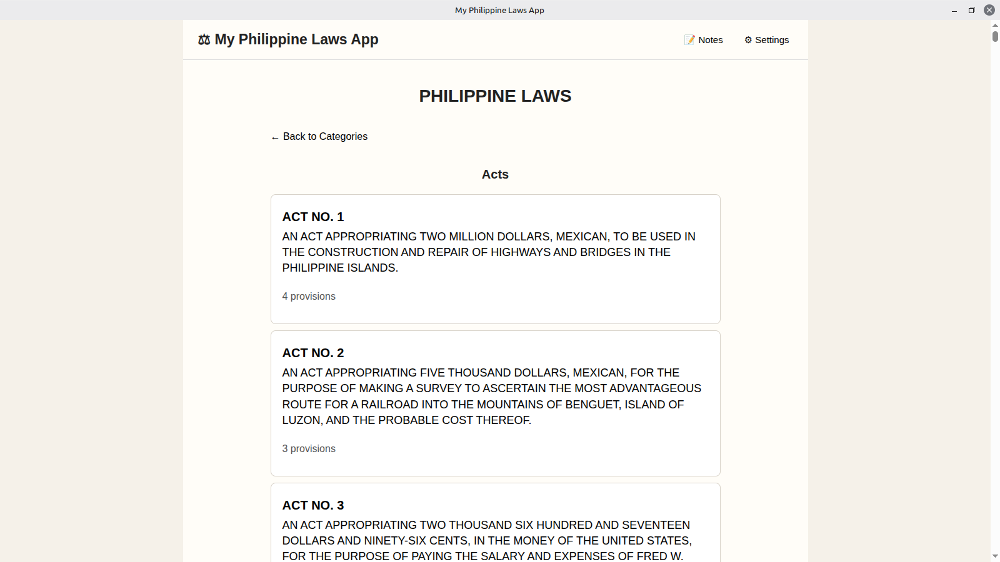
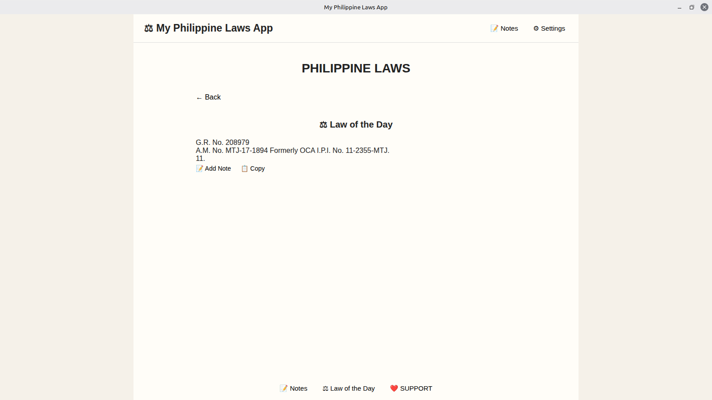

# My Philippine Laws App

An offline desktop application for browsing Philippine laws and legal issuances.

## Features

- Offline access to Philippine laws
- Search and browse laws
- View laws and provisions
- Bookmarks and notes
- Law of the Day
- Jurisprudence collection
- Linux desktop application

## Supported Categories

The application includes:

- Acts
- Administrative Orders
- Batas Pambansa
- Codes
- Commonwealth Acts
- Constitution
- Court Issuances
- Executive Orders
- Jurisprudence
- Memorandum Circulars
- Memorandum Orders
- Other Issuances
- Presidential Decrees
- Proclamations
- Republic Acts
- Special Orders

## Downloads

Available as Debian/Ubuntu/Linux Mint (.deb), AppImage, and Flatpak.

## Release

Current release: v1.0.0

## Author

Frex L. Insao
## Installation

Download the packages from the [v1.0.0 release](https://github.com/frexlinsao-bit/myphilippinelawsapp/releases/tag/v1.0.0).

### Debian / Ubuntu / Linux Mint

Install the `.deb` package with:

    sudo apt install ./philippine-laws-app_1.0.0_amd64.deb

### AppImage

Make the AppImage executable and run it:

    chmod +x "My Philippine Laws App-1.0.0.AppImage"
    ./"My Philippine Laws App-1.0.0.AppImage"

### Flatpak

Install the Flatpak bundle with:

    flatpak --user install "My Philippine Laws App-1.0.0.flatpak"

Launch it with:

    flatpak run io.github.frexlinsao_bit.MyPhilippineLawsApp
## Screenshots

